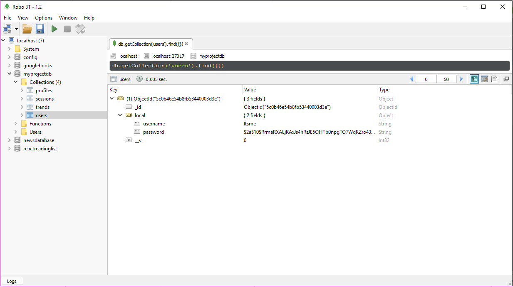
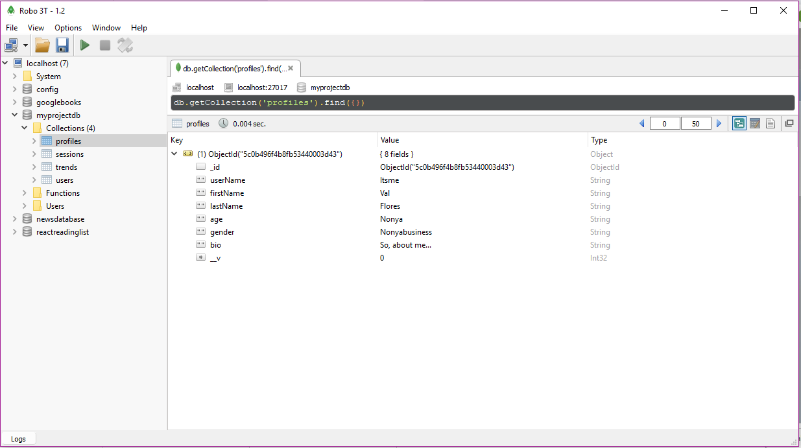
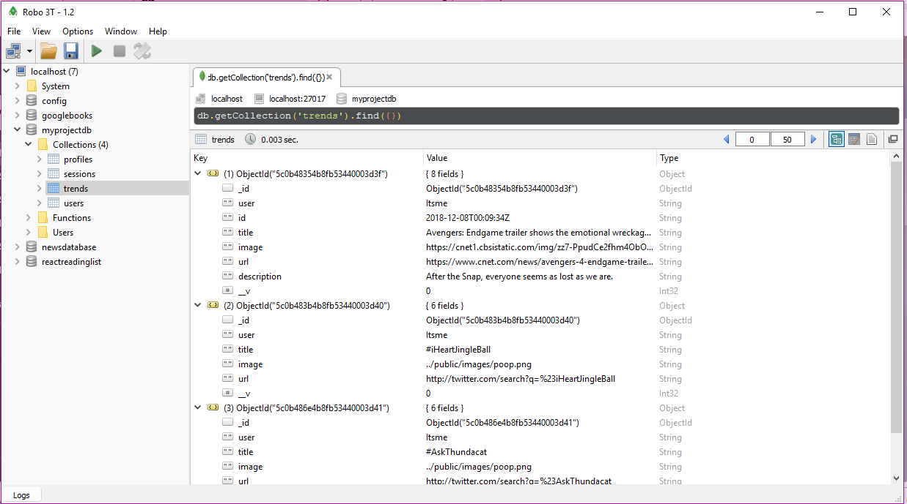

# PlatonicMingle
Platonic Mingle is a revolutionary app designed to profoundly increase your social skills in situations where you might need the extra help. As much as we would like to know everything, we can't. We are not Google (or Bing). But now our consumers will be able to grasp the trending topics of the day, week, or month in a simple, yet effective fashion in order to prepare for an interview, search for interesting topics for a date, or even be able to seamlessly speak about how many goals the New York Dodgers were able to putt through the field-goal!

* User must set up credentials so that their personal searches are saved for themselves
* User’s home screen lists current trending topics from Twitter and Buzzfeed, allowing user to choose a favorite trend to learn more about
* User may save favorite articles to the MongoDB database

Currently in the works:
 * 'Mingle' option, where users will be matched to each other based on their profile and favorites.  Make friends without leaving the confort of your house!
 * Web-based app, in case you want to give your phone a rest

Demo of the current app:
 
  

## Getting Started
Since this is a mobile app built with React-Native, only the server is deployed to Heroku [here](https://platonic-mingle.herokuapp.com/).  In order to see this app, the user will need to run the code from the [repository](https://github.com/valeriemiller5/Platonic-Mingle) locally, then use `yarn start:all` in the terminal to start the app and the server.

## Prerequisites
Google Chrome (PC) or Safari (Mac) is recommended for running this program.

## Running the tests
Logs have been set at various points in this program. To see test the code, check the command terminal for messages.

Notable issues when creating this program were conflicts with branch deployments to GitHub.  Through updates, most of these conflicts have been addressed.

## How it works
Logging in:
 

Once user has been created, their loggin credentials are saved to the database:

Create a profile:
 

Once a profile is created, it is saved under the user's account in the database:

Save favorite trends:
 

Trends and articles will automatically render.  When the heart icon is clicked, the article is saved to the favorites screen and the user's database:

COMING SOON - Mingle:
Connect with other PlatonicMingle users - make friends without actually talking to someone
 

## Built With
* React-Native
* Node.js
* Express.js
* MongoDB/Mongoose
* Twitter Trends API
* Buzzfeed API

## Authors
* Front End Design – Julio Valdez
* User Authentication, BuzzFeed API, and back-end – Chad Tao
* Twitter Trends API and back-end – Valerie Flores
* Favorites – Ray Ventura

## Acknowledgments
Thank you to all the members of the PlatonicMingle team, classmates, instructor, and TA's of UC Irvine Coding Bootcamp, and the many examples of other coders online.
